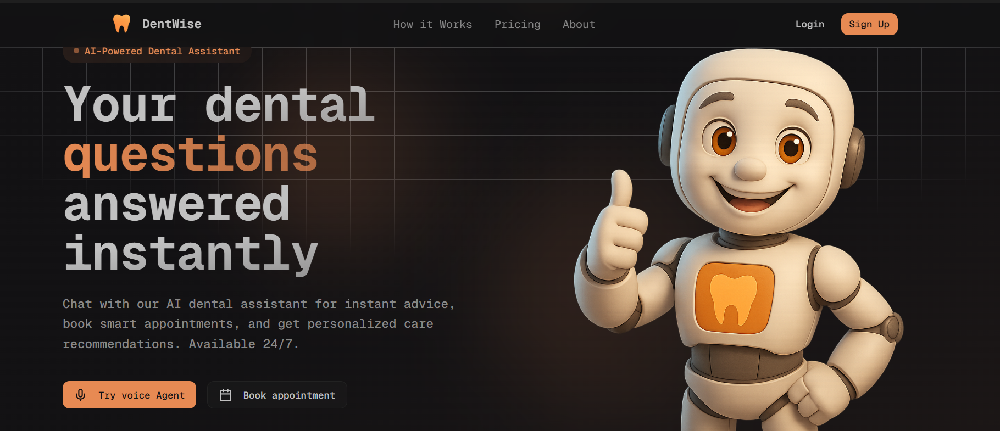
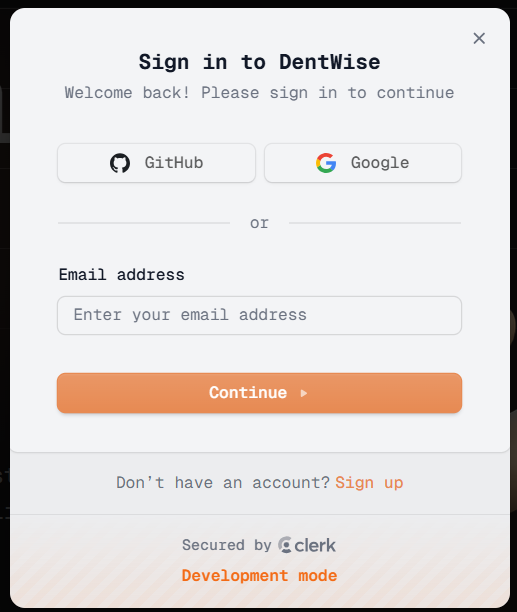
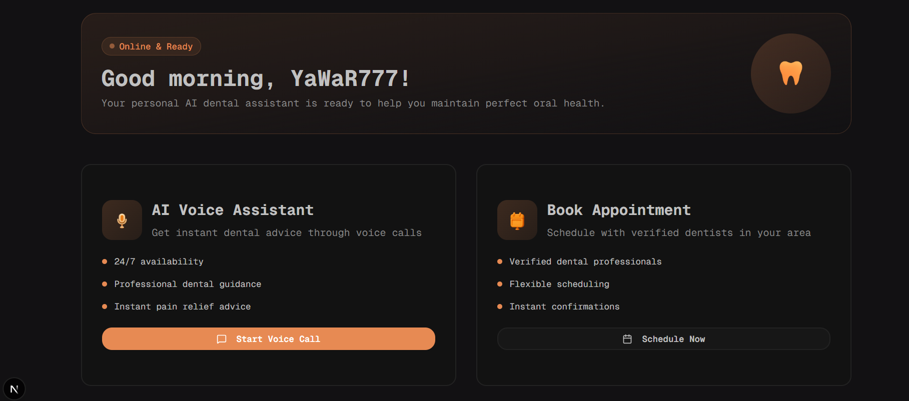
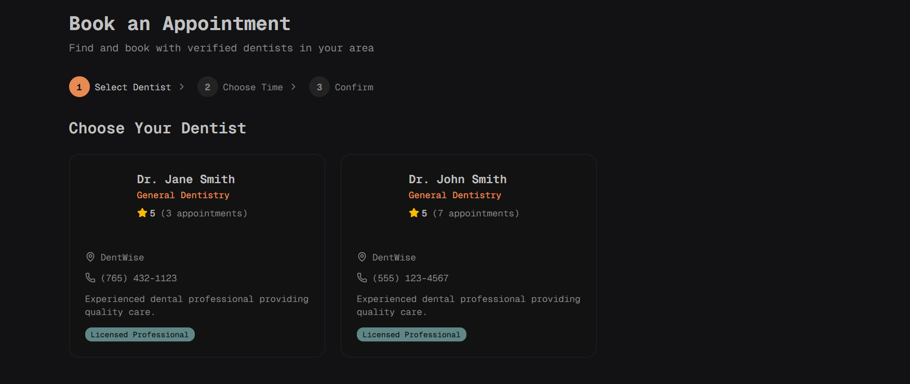
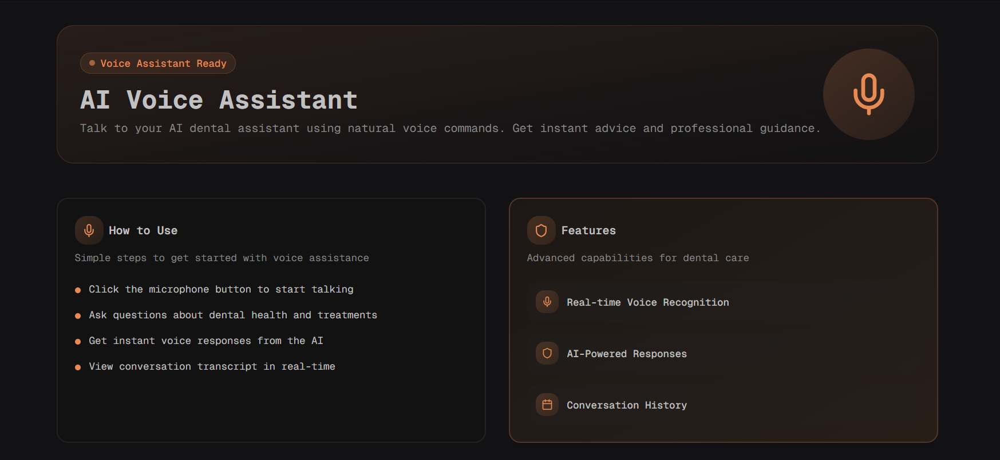
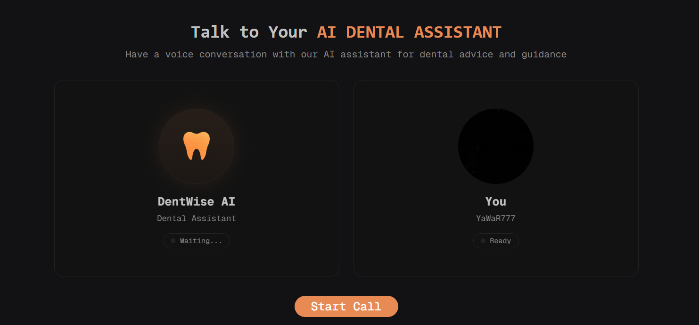
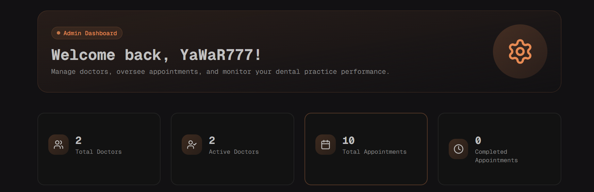
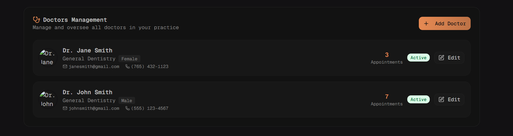

# 🦷 DentiWise

DentiWise is a modern dentist appointment booking platform that allows patients to easily schedule appointments with dentists through an intuitive interface. The application also features an AI-powered voice assistant using Vapi for conversational appointment booking and an admin dashboard for managing doctors and appointments.

---

 

## 🚀 Features

### 👨‍⚕️ Patient Features

- Secure authentication with Clerk
- Browse available dentists
- View detailed doctor profiles
- Book appointments with preferred doctors
- Select convenient date and time slots
- Manage upcoming appointments
- AI-powered voice booking using Vapi
- Appointment confirmation and notification emails via Resend
- Subscription plans for premium features
- Responsive interface optimized for desktop and mobile devices

 

  
 
 

### 🛠️ Admin Features

- Secure admin dashboard
- Add, edit, and remove doctors
- Manage appointments and schedules
- Track booking status
- Manage doctor availability
- Monitor patient subscriptions

 
 

---

## 🛠 Tech Stack

### Frontend

- Next.js
- React
- TypeScript
- Tailwind CSS
- Shadcn UI

### Backend

- Next.js API Routes
- Prisma ORM

### Database

- PostgreSQL

### Authentication

- Clerk Authentication

### AI & Voice

- Vapi AI Voice Assistant

### Email Service

- Resend

### Subscription Management

- Subscription Plans

### Deployment

- Vercel

## ⚙️ Installation

Clone the repository

```bash
git clone https://github.com/yawar3773/dentiwise.git
```

Move into the project

```bash
cd dentiwise
```

Install dependencies

```bash
npm install
```

Create a `.env` file

```env
DATABASE_URL=
NEXT_PUBLIC_APP_URL=
CLERK_SECRET_KEY
RESEND_API_KEY=
ADMIN_EMAIL
NEXT_PUBLIC_VAPI_API_KEY=
NEXT_PUBLIC_CLERK_PUBLISHABLE_KEY

# Add other required environment variables
```

Run Prisma migrations

```bash
npx prisma migrate dev
```

Generate Prisma Client

```bash
npx prisma generate
```

Start the development server

```bash
npm run dev
```

---

## 💡 How It Works

1. User browses available dentists.
2. Selects a preferred doctor.
3. Chooses a suitable appointment slot.
4. Confirms the booking.
5. Users can also interact with the AI Voice Assistant to book appointments conversationally.
6. Admin manages doctors and appointments from the dashboard.

---

## 🔮 Future Improvements

- Payment Gateway Integration
- Email Notifications
- SMS Appointment Reminders
- Google Calendar Integration
- Video Consultation Support
- Patient Medical History
- Doctor Availability Calendar
- Appointment Analytics Dashboard

---

## 📦 Scripts

```bash
npm run dev       # Development server
npm run build     # Production build
npm run start     # Start production server
npm run lint      # Run ESLint
```

---

## 🤝 Contributing

Contributions are welcome!

1. Fork the repository
2. Create a new branch

```bash
git checkout -b feature-name
```

3. Commit your changes

```bash
git commit -m "Added new feature"
```

4. Push your branch

```bash
git push origin feature-name
```

5. Open a Pull Request


## 👨‍💻 Author

Developed by **Mohd Yawar**

If you found this project helpful, consider giving it a ⭐ on GitHub!